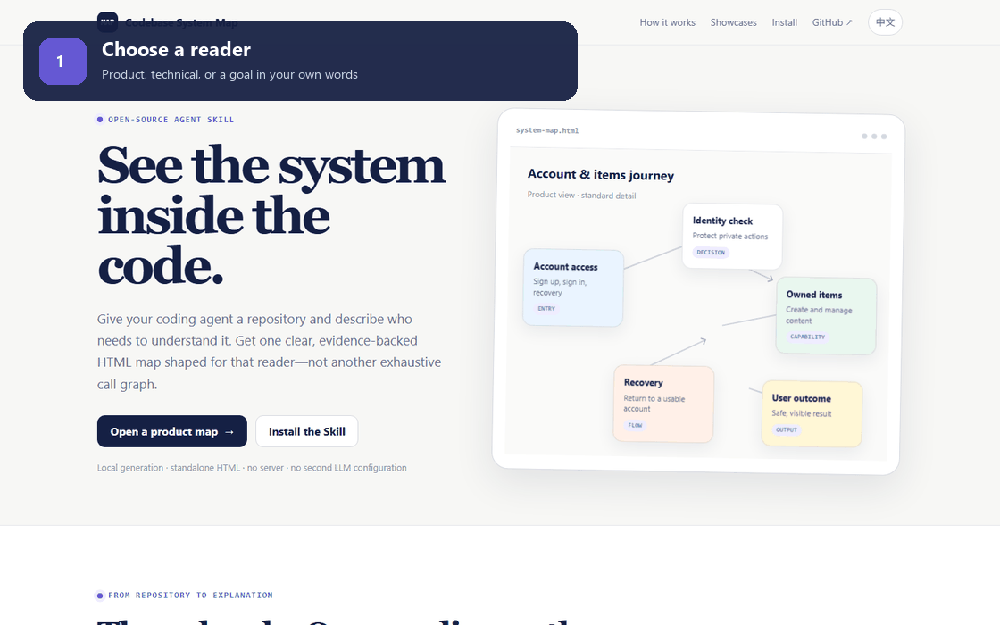

# Codebase System Map

> 给 Coding Agent 一个代码库，得到一份产品人员也能读懂、且有源码证据的系统地图。

[项目主页与在线案例](https://farmer-zh.github.io/codebase-system-map/zh/) · [English](README.md)

Codebase System Map 是一个用于代码库可视化、软件架构说明和新人上手的开源
Agent Skill。它让已经能够阅读仓库的 Coding Agent 沿真实运行路径理解代码，
再生成一份可以离线打开和单文件分享的 HTML。

- **按照读者设计内容：**直接说明文档给谁看、希望理解或决定什么。
- **通过对话调整：**用自然语言修改模块、颗粒度、术语和展示重点。
- **结论有源码支撑：**重要模块和节点关联仓库文件与有效行号。
- **独立离线使用：**最终 HTML 不需要服务器、CDN 或账号。
- **不再配置第二套模型：**Skill 直接使用用户已有的 Coding Agent。

~~~text
代码库
  → Agent 沿关键运行路径阅读源码
  → 有证据的 System Map IR
  → 本地确定性校验
  → 单文件 system-map.html
~~~

生成完成后可以关闭 Agent 和终端，HTML 仍然可以正常打开和分享。

## 生成的内容

文档最多包含三个渐进层级：

1. **系统总览：**这个仓库实现什么能力、有哪些主要职责、核心路径如何产生结果。
2. **模块视图：**有产品或运行意义的模块、模块边界以及模块之间的重要关系。
3. **节点详情：**职责、输入、输出、源码证据，以及仓库确实使用 LLM 时的真实
   Prompt 摘录。

它不是目录树、依赖列表或穷举调用图。地图只展开当前读者真正需要理解的部分。

## 三个案例

每个案例都固定了公开仓库的完整 commit，并提供独立 HTML、可继续修改的 IR 和
生成元数据。

| 仓库 | 展示目标 | 结果 |
| --- | --- | --- |
| [Huey](https://github.com/coleifer/huey) | 给技术人员理解任务声明、队列、调度、Worker、重试与结果 | [HTML](showcases/huey/system-map.html) · [IR](showcases/huey/system-map.json) |
| [Full Stack FastAPI Template](https://github.com/fastapi/full-stack-fastapi-template) | 给产品人员理解注册、登录、找回密码和用户自有 Items 体验 | [HTML](showcases/full-stack-fastapi-template/system-map.html) · [IR](showcases/full-stack-fastapi-template/system-map.json) |
| [OpenAI Agents SDK](https://github.com/openai/openai-agents-python) | 给跨职能团队理解运行循环、工具、handoff、guardrail、session、tracing 和真实 handoff Prompt | [HTML](showcases/openai-agents-python/system-map.html) · [IR](showcases/openai-agents-python/system-map.json) |

下载任意 HTML 后，用现代浏览器直接打开即可离线查看。每个案例旁边的
metadata.json 记录了仓库、commit、许可证、展示简报和内容数量。

## 快速开始

### 环境要求

- 一个能够读取目标仓库并执行本地命令的 Coding Agent；
- Node.js 18 或更高版本；
- Git 可选，但建议安装，以便在结果中记录分析版本。

内置校验器和渲染器不需要安装依赖，也不会访问网络。

### 1. 克隆仓库

~~~powershell
git clone https://github.com/Farmer-Zh/codebase-system-map.git
cd codebase-system-map
~~~

### 2. 安装 Skill

Codex 本地安装，Windows PowerShell：

~~~powershell
$skillPath = Join-Path $env:USERPROFILE ".codex\skills\codebase-system-map"
New-Item -ItemType Directory -Force $skillPath | Out-Null
Copy-Item -Path ".\codebase-system-map\*" -Destination $skillPath -Recurse -Force
~~~

macOS 或 Linux：

~~~bash
mkdir -p "$HOME/.codex/skills/codebase-system-map"
cp -R codebase-system-map/. "$HOME/.codex/skills/codebase-system-map/"
~~~

安装或更新后，打开一个新的 Agent 会话，使可用 Skill 列表重新载入。

其他兼容 Agent Skills 的 Coding Agent 可以按照各自的 Skill 发现方式安装
codebase-system-map 目录。入口文件是
[SKILL.md](codebase-system-map/SKILL.md)。

### 3. 直接说明你要看的内容

给产品经理看：

~~~text
使用 codebase-system-map 分析这个仓库。
生成一份给产品经理看的标准颗粒度系统图。重点解释每个模块做什么、
用户最终看到什么，以及仓库中的真实 Prompt；合并框架和数据库管线。
~~~

给工程师做技术评审：

~~~text
使用 codebase-system-map 分析这个仓库，给工程师看。
使用 deep 颗粒度，保留运行顺序、分支、异步任务、状态变化、
外部接口和源码证据。
~~~

目标仓库不在当前目录时，直接提供路径。也可以明确指定输出语言和保存位置。
如果没有指定语言，Agent 会跟随仓库主要说明文档的语言。

## 用对话改变颗粒度

产品视图、技术视图不是两个僵硬模板。Agent 会把用户的自然语言整理为展示简报，
并真正改变模块边界、节点颗粒度、名称、Prompt、关系、排序和折叠层级，而不只是
切换样式。

看到第一版后，可以继续说：

~~~text
支付模块再详细一点，但普通数据库调用合并掉。
~~~

~~~text
把这两个 Prompt 放到主要阅读路径，说明它们分别怎样影响最后回复。
源码路径默认隐藏，但保留在 IR 证据里。
~~~

~~~text
这份图给客户成功团队做上手培训。用产品语言重命名技术阶段，
重点解释失败恢复。
~~~

Agent 会修改已有 IR，只补充新需求需要的证据，然后重新校验并原子替换 HTML。
同一份文档中的不同模块可以故意使用不同颗粒度。

## 输出文件

默认输出：

~~~text
<目标仓库>/.codebase-map/system-map.json
<目标仓库>/generated/<仓库名>/system-map.html
~~~

- system-map.json 是有证据、可继续修订的结构化源文件；
- system-map.html 是提供给读者打开和分享的文件。

HTML 已内嵌图形渲染器和 WebAssembly，不会启动本地服务器，也不会在运行时访问
网络。浏览器需要启用 JavaScript 才能绘制图形，文档文字始终保存在文件内部。

## 为什么结果更可信

Skill 要求 Agent：

1. 先确定仓库边界和分析的 Git 版本；
2. 沿真实运行路径取证，而不是把所有文件列出来；
3. 为重要结论引用紧凑的仓库相对路径和源码行号；
4. 只有仓库中存在真实 Prompt 或组装逻辑时才生成 Prompt 卡片；
5. 校验 Schema、引用、拓扑、入口、输出、孤立节点和连续主路径；
6. 校验失败时最多执行两轮由诊断驱动的局部修复；
7. 只有验证通过后才生成 HTML。

交付采用原子替换。验证或渲染失败不会覆盖上一份可用 HTML。

## 手动诊断

这些命令通常由 Agent 自动执行。需要自己排查时，在已安装的 Skill 目录运行：

~~~powershell
node scripts/system-map.mjs doctor
node scripts/system-map.mjs validate "C:\path\to\system-map.json" --repo "C:\path\to\repository" --json
node scripts/system-map.mjs deliver "C:\path\to\system-map.json" "C:\path\to\system-map.html" --repo "C:\path\to\repository" --json
~~~

Windows 路径包含空格时必须加引号。

## 隐私与限制

- 源码阅读和内容判断由用户已有的 Agent 完成；
- 内置 validator 和 renderer 不调用 LLM 或外部服务；
- HTML 和 IR 可能暴露仓库路径、系统行为与 Prompt 摘录，公开发布前应先审查；
- 结果是针对主要行为的有限解释，不保证穷举所有运行路径；
- 证据对应分析时的源码版本，仓库发生重要变化后应重新生成；
- 非 LLM 项目没有真实 Prompt 时，不显示 Prompt 模块是正确结果。

## 项目结构

~~~text
codebase-system-map/
  SKILL.md                         Agent 工作流
  agents/openai.yaml               Skill 元数据与默认请求
  references/                      展示、证据、建模、交付契约
  schemas/system-map.schema.json   System Map IR 2.0
  scripts/system-map.mjs           doctor、validate、deliver
  assets/                          离线图形渲染资源与许可证
showcases/
  manifest.json                    固定版本和展示简报
  <case>/                          独立 HTML、IR、元数据
tests/
  system-map-cli.test.mjs          确定性校验与渲染测试
DESIGN.md                          视觉设计方向
~~~

## 开发

使用 Node.js 18 或更高版本运行确定性测试：

~~~powershell
npm test
~~~

测试覆盖环境自检、IR 验证、不同受众的展示方式、独立 HTML 交付，以及失败时保护
上一份可用文件。

## 使用的开源组件

项目有意保持很小。校验器、交付 CLI 和 GitHub Pages 只使用 Node.js 内置模块与
原生 HTML、CSS、JavaScript。为了让图形完全离线运行，生成的 HTML 会内嵌以下
第三方组件：

| 组件 | 用途 | 许可证 |
| --- | --- | --- |
| [Viz.js 3.29.0](https://github.com/mdaines/viz-js) | 每份 HTML 内嵌的 JavaScript 封装与 WebAssembly 图形渲染器 | MIT |
| [Graphviz](https://graphviz.org/) | 在 Viz.js WebAssembly 中完成 DOT 布局并生成 SVG | Eclipse Public License 2.0 |
| [Expat](https://github.com/libexpat/libexpat) | 由 Viz.js 对象代码间接包含的 XML 解析器 | MIT |

完整说明见 [THIRD_PARTY_NOTICES.md](THIRD_PARTY_NOTICES.md)，许可证全文保存在
[codebase-system-map/assets/licenses](codebase-system-map/assets/licenses/)。

## 许可证

[MIT](LICENSE)。第三方组件继续使用各自的许可证。
